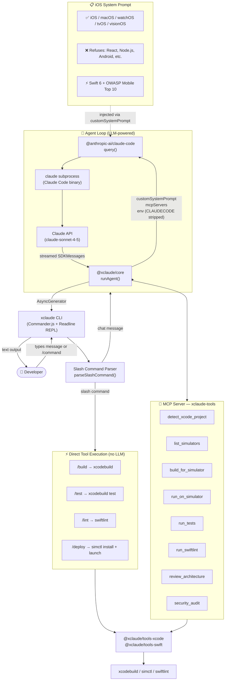
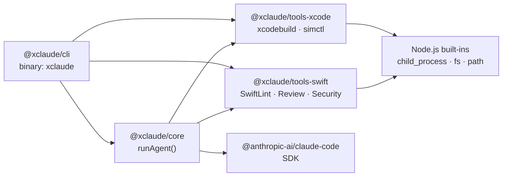
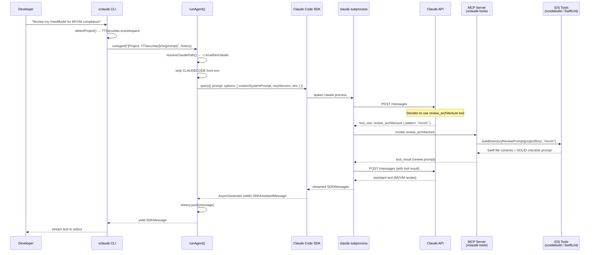
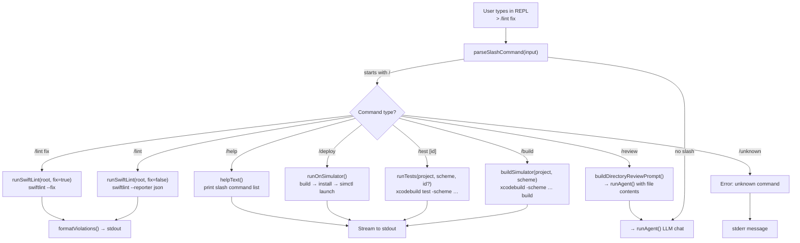
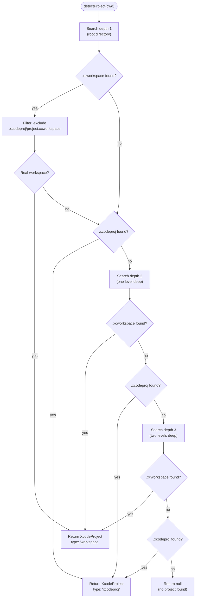
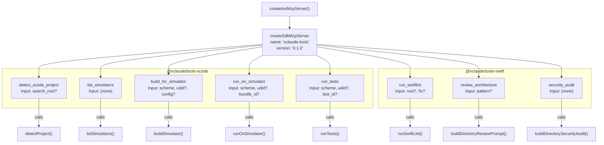
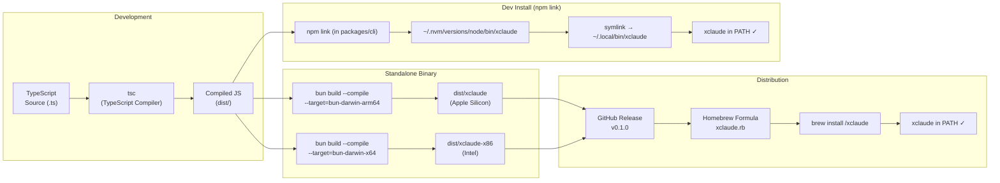

# xclaude

> iOS-focused Claude Code CLI — an AI coding assistant exclusively for Apple platform development.

`xclaude` is a specialised variant of [Claude Code](https://claude.ai/claude-code) that restricts itself to iOS, macOS, watchOS, tvOS, and visionOS development. It understands your Xcode project, runs SwiftLint, executes builds, runs tests, deploys to simulators, and refuses to help with anything outside the Apple ecosystem.

```bash
xclaude                               # interactive REPL (auto-detects Xcode project)
xclaude "how do I use @Observable?"  # one-shot prompt
xclaude --project ~/MyApp            # specify project path
```

---

## Table of Contents

- [How It Works](#how-it-works)
- [Architecture Diagrams](#architecture-diagrams)
- [Installation](#installation)
- [Usage](#usage)
- [Slash Commands](#slash-commands)
- [Monorepo Structure](#monorepo-structure)
- [Package Reference](#package-reference)
- [Development](#development)
- [Distribution](#distribution)

---

## How It Works

xclaude wraps the `@anthropic-ai/claude-code` SDK. When you send a message, it:

1. **Detects** your Xcode project automatically (`.xcworkspace` preferred over `.xcodeproj`)
2. **Injects** an iOS-only system prompt that restricts the model to Apple platform topics
3. **Registers** 8 iOS-specific tools as an MCP server (xcodebuild, simctl, SwiftLint, etc.)
4. **Spawns** the Claude Code process with your prompt and streams the response back

Slash commands (`/build`, `/lint`, `/test`, `/deploy`) bypass the LLM entirely and run native tools directly — giving you instant, deterministic output.

---

## Architecture Diagrams

### Overall System Flow



---

### Package Dependency Graph



---

### Agent Loop (Detailed)



---

### Slash Command Dispatch Flow



---

### Project Detection Flow



---

### MCP Tool Registration



---

### Build & Distribution Pipeline



---

## Installation

### Option 1 — curl (recommended, macOS)

```bash
curl -fsSL https://raw.githubusercontent.com/arimunandar/XClaude/main/install.sh | bash
```

The script detects your architecture, downloads the pre-built binary from GitHub Releases, and places it in `~/.local/bin/xclaude`. Falls back to `npm install` or building from source if no release binary is available yet.

### Option 2 — npm (like Claude Code)

```bash
npm install -g @xclaude/cli
```

> **Note:** Requires you to publish `@xclaude/cli` to npm first (see [Publishing to npm](#publishing-to-npm)).
> The package uses `bundledDependencies` — all internal packages are bundled into a single install.

### Option 3 — Homebrew

```bash
brew tap arimunandar/xclaude
brew install xclaude
```

> Requires publishing a binary release to GitHub first (the formula downloads the pre-built binary).

### Option 4 — Build from source

```bash
git clone https://github.com/arimunandar/XClaude.git
cd XClaude
npm install
npm run build

# Link globally
cd packages/tools-xcode && npm link
cd ../tools-swift && npm link
cd ../core && npm link
cd ../cli && npm link @xclaude/tools-xcode @xclaude/tools-swift @xclaude/core && npm link

# Add to PATH if needed (nvm users)
ln -sf "$(which xclaude)" ~/.local/bin/xclaude

xclaude --version   # → 0.1.0
```

### Prerequisites

| Tool | Required | Purpose |
|------|----------|---------|
| `claude` CLI | **Required** | xclaude spawns it internally — install via `npm install -g @anthropic-ai/claude-code` |
| Xcode | **Required** | `xcodebuild` and `xcrun simctl` |
| SwiftLint | Optional | `/lint` command — `brew install swiftlint` |
| Bun | Optional | Building standalone binaries only |

---

## Usage

### Interactive REPL

```bash
cd ~/MyApp          # any directory with an Xcode project
xclaude             # starts the interactive REPL

xclaude — iOS-focused Claude Code assistant
──────────────────────────────────────────────────
Detected .xcworkspace: MyApp.xcworkspace (~/MyApp)
Type /help for commands, or start chatting. Ctrl+C to exit.

>
```

### One-Shot Mode

```bash
# Ask a question
xclaude "how do I implement certificate pinning in URLSession?"

# Point at a specific project
xclaude --project ~/MyApp --scheme MyApp "review my networking layer"

# Pipe output
xclaude "list the OWASP checks I should do before App Store submission" > checklist.md
```

---

## Slash Commands

Slash commands run **native tools directly** — no LLM involved, instant output.

| Command | What it does | Native tool |
|---------|-------------|-------------|
| `/build` | Build for simulator (Debug) | `xcodebuild` |
| `/test` | Run full test suite | `xcodebuild test` |
| `/test MyTests/testLogin` | Run a specific test | `xcodebuild -only-testing` |
| `/lint` | Show SwiftLint violations | `swiftlint --reporter json` |
| `/lint fix` | Auto-fix SwiftLint violations | `swiftlint --fix` |
| `/review` | Architecture review (MVVM/VIP/TCA) | LLM + file contents |
| `/deploy` | Build → install → launch on simulator | `simctl install + launch` |
| `/help` | Show this table | — |

> **Note:** `/review` does call the LLM — it loads your Swift files and asks Claude to review them against SOLID principles and your architecture pattern.

---

## Monorepo Structure

```
xclaude/                           ← monorepo root
├── rush.json                      ← Rush workspace config
├── package.json                   ← npm workspaces (Rush fallback)
├── jest.config.js                 ← Test config (ESM + ts-jest)
├── scripts/
│   └── build-binary.sh           ← Bun compile → standalone binary
├── homebrew/
│   └── Formula/xclaude.rb        ← Homebrew formula
├── e2e/
│   └── project-detection.test.ts ← End-to-end test suite (52 tests)
└── packages/
    ├── tools-xcode/               ← @xclaude/tools-xcode
    │   └── src/
    │       ├── detect.ts          ← xcworkspace/xcodeproj discovery
    │       ├── simulators.ts      ← simctl list + best-sim selection
    │       ├── build.ts           ← xcodebuild (streaming)
    │       ├── run.ts             ← build + install + simctl launch
    │       └── test.ts            ← xcodebuild test + result parsing
    ├── tools-swift/               ← @xclaude/tools-swift
    │   └── src/
    │       ├── lint.ts            ← SwiftLint JSON parsing
    │       ├── review.ts          ← MVVM/VIP/TCA review prompt builder
    │       └── security.ts        ← OWASP Mobile Top 10 audit prompt
    ├── core/                      ← @xclaude/core
    │   └── src/
    │       ├── agent.ts           ← runAgent(), SDK query() wrapper
    │       ├── tools.ts           ← MCP server (8 tools via zod schemas)
    │       └── prompt.ts          ← iOS-only system prompt
    └── cli/                       ← @xclaude/cli (binary: xclaude)
        └── src/
            ├── index.ts           ← Commander.js entry, one-shot + REPL
            ├── commands.ts        ← Slash command parser + dispatch types
            └── ui.ts              ← Readline REPL with ANSI colours
```

---

## Package Reference

### `@xclaude/tools-xcode`

Shell wrappers for Xcode toolchain. No SDK dependency.

```typescript
import { detectProject, listSimulators, buildSimulator, runTests, runOnSimulator } from "@xclaude/tools-xcode";

// Auto-detect project (3 levels deep, xcworkspace preferred)
const project = detectProject("/path/to/MyApp");
// → { type: "workspace", root: "...", workspace: "MyApp.xcworkspace" }

// List available simulators
const sims = listSimulators();
// → [{ udid, name, state: "Booted" | "Shutdown", runtime }]

// Build for simulator (streaming)
const result = await buildSimulator(
  { project, scheme: "MyApp", configuration: "Debug" },
  (line) => process.stdout.write(line + "\n")
);

// Run tests
const testResult = await runTests({ project, scheme: "MyApp" });
// → { passed: 42, failed: 0, skipped: 2, failures: [] }

// Build + install + launch
const runResult = await runOnSimulator({ project, scheme: "MyApp" });
```

### `@xclaude/tools-swift`

SwiftLint runner and LLM prompt builders. No SDK dependency.

```typescript
import { runSwiftLint, formatViolations, buildDirectoryReviewPrompt, buildDirectorySecurityAudit } from "@xclaude/tools-swift";

// Run SwiftLint
const result = runSwiftLint("/path/to/project", false /* fix */);
console.log(formatViolations(result));
// ⚠ LoginView.swift:42:5 [trailing_whitespace] Trailing whitespace
// ✖ NetworkManager.swift:88:1 [force_cast] Force casts should be avoided

// Build architecture review prompt (for passing to the agent)
const { userPrompt } = buildDirectoryReviewPrompt("/path/to/project", "mvvm");

// Build OWASP security audit prompt
const { userPrompt } = buildDirectorySecurityAudit("/path/to/project");
```

### `@xclaude/core`

Agent loop wrapping the Claude Code SDK.

```typescript
import { runAgent, extractTextFromMessages } from "@xclaude/core";

const history = [];

// Streaming (for REPL/one-shot)
for await (const message of runAgent("how do I use @Observable?", history)) {
  if (message.type === "assistant") {
    for (const block of message.message.content) {
      if (block.type === "text") process.stdout.write(block.text);
    }
  }
}

// Non-streaming (for testing/scripting)
const messages = await runAgentCollected("explain actors in Swift 6", history);
const text = extractTextFromMessages(messages);
```

---

## Development

### Setup

```bash
npm install       # install all workspace dependencies
npm run build     # compile all packages (TypeScript → JS)
npm test          # run 87 tests across 7 suites
npm run test:coverage  # with coverage report
```

### Running Without Linking

```bash
node packages/cli/dist/index.js "your prompt here"
```

### Adding a New Tool

1. Implement the function in `packages/tools-xcode/src/` or `packages/tools-swift/src/`
2. Export it from the package's `src/index.ts`
3. Register it in `packages/core/src/tools.ts` using `tool()` from the SDK with a zod schema
4. (Optional) Add a slash command in `packages/cli/src/commands.ts` and dispatch in `index.ts`
5. Write tests in `src/__tests__/`

### Test Structure

```
packages/tools-xcode/src/__tests__/
  detect.test.ts       (7 tests)  — project detection, depth limits
  simulators.test.ts   (6 tests)  — simctl JSON parsing, state

packages/tools-swift/src/__tests__/
  lint.test.ts         (8 tests)  — violation parsing, --fix flag
  review.test.ts       (8 tests)  — SOLID checklist, file content injection
  security.test.ts     (9 tests)  — OWASP M1-M10, Keychain checks

packages/cli/src/__tests__/
  commands.test.ts    (14 tests)  — slash command parsing, case-insensitivity

e2e/
  project-detection.test.ts (35 tests) — full pipeline integration tests
```

---

## Distribution

### Creating a Release

Push a version tag — GitHub Actions automatically builds binaries and publishes to npm:

```bash
# Bump version in all package.json files first, then:
git tag v0.1.0
git push origin v0.1.0
```

The `release.yml` workflow will:
1. Build Bun standalone binaries (`xclaude-arm64`, `xclaude-x86_64`)
2. Create a GitHub Release and attach both binaries
3. Publish `@xclaude/cli` to npm (with bundled internal packages)

### Publishing to npm

1. Create an npm account and the `@xclaude` organisation (or use your personal scope)
2. Add `NPM_TOKEN` to your GitHub repository secrets
3. Push a version tag (see above) — the release workflow handles publishing

Users can then install with:
```bash
npm install -g @xclaude/cli
```

### Publishing to Homebrew

1. Run `./scripts/build-binary.sh` locally (or grab binaries from a GitHub Release)
2. Update `homebrew/Formula/xclaude.rb` with the SHA256 checksums and release URL
3. Create a tap repository `homebrew-xclaude` and push the formula

```bash
brew tap arimunandar/xclaude
brew install xclaude
```

### Building Standalone Binaries (local)

```bash
# Requires bun (https://bun.sh)
./scripts/build-binary.sh

# Output:
# dist/xclaude      → Apple Silicon (arm64), no Node.js required
# dist/xclaude-x86  → Intel (x86_64), no Node.js required
```

---

## System Prompt — Scope Boundaries

xclaude enforces these rules via the system prompt injected into every query:

**Accepts:** iOS, macOS, watchOS, tvOS, visionOS — Swift, SwiftUI, UIKit, Core Data, SwiftData, CloudKit, Realm, URLSession, XCTest, Swift Testing, Instruments, SPM, CocoaPods, Carthage

**Refuses:** React, Vue, Angular, Node.js, Python, Rails, Django, PostgreSQL, MySQL, MongoDB, Android, Flutter (cross-platform)

When a refused topic is detected, xclaude responds:
> *"I'm xclaude, specialised exclusively in Apple platform development. I can't help with [topic], but I'm here to help with any iOS, macOS, watchOS, tvOS, or visionOS questions!"*

---

## Environment Variables

| Variable | Default | Purpose |
|----------|---------|---------|
| `IOS_CODE_CLAUDE_PATH` | auto-detected | Override path to `claude` binary |
| `CLAUDECODE` | — | Automatically stripped to allow xclaude to run inside Claude Code sessions |

---

## License

MIT
